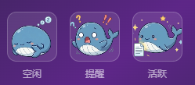
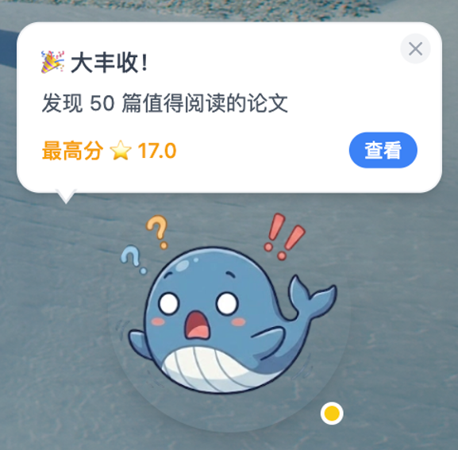
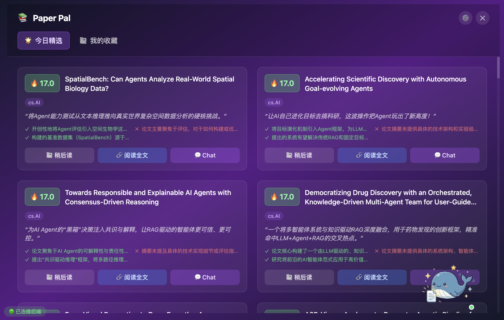
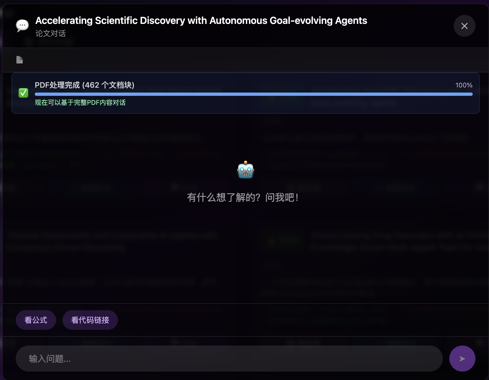

# Paper Pal 🐾

你的桌面 AI 论文阅读伴侣 - 一个可爱的桌面精灵，帮助你追踪和阅读最新的 AI 论文。

[English](README.md) | 中文文档

## ✨ 功能特性

- 🔍 **自动论文抓取** - 从 ArXiv 获取最新 AI 论文
- 🤖 **AI 智能评分** - 使用 LLM API 根据你的兴趣对论文评分
- 📄 **PDF 全文分析** - 下载并分析完整的 PDF 内容
- 💬 **智能问答** - 基于 RAG 的 PDF 全文对话，获得准确答案
- 🔍 **多语言搜索** - 支持中英文语义和关键词搜索
- 🏷️ **回复来源标签** - 清晰标识回复是基于 PDF 还是摘要
- 🖥️ **桌面精灵** - 可爱的桌面宠物，提醒你新论文
- 🎨 **自定义皮肤** - 拖放 GIF/PNG 文件更换皮肤
- 📚 **稍后阅读** - 保存论文以便稍后阅读
- ⚡ **智能降级** - PDF 处理失败时自动降级到摘要模式

## 🚀 快速开始

### 环境要求

- Node.js 18+
- [uv](https://docs.astral.sh/uv/)（推荐的 Python 包管理器）
- LLM API Key（支持 OpenRouter、Gemini、OpenAI、Deepseek）

> **注意**：uv 会自动管理 Python 版本和虚拟环境，无需单独安装 Python。

### 0. 安装 uv（推荐）

```bash
# Windows (PowerShell)
powershell -ExecutionPolicy ByPass -c "irm https://astral.sh/uv/install.ps1 | iex"

$env:Path = "C:\Users\你的用户名\.local\bin;$env:Path"

# macOS / Linux
curl -LsSf https://astral.sh/uv/install.sh | sh
```

> **重要**：安装后必须重启终端，`uv` 命令才能生效。

### 1. 安装依赖

```bash
# 安装前端依赖
# 设置中国镜像源（可选，加速下载）npm config set registry https://registry.npmmirror.com
npm install

# 安装后端依赖（使用 uv - 推荐）
cd backend
uv venv --python 3.12                # 创建虚拟环境，已知问题：高版本Python容易有库冲突不适配问题
uv pip install -r requirements.txt   # 安装依赖

# 备选方案：使用传统 pip（需要预先安装 Python 3.9+）
# cd backend
# python -m venv .venv
# .venv\Scripts\activate  # Windows
# source .venv/bin/activate  # Mac/Linux
# pip install -r requirements.txt
```

> **为什么选择 uv？** uv 会自动下载和管理 Python 版本，创建隔离环境，安装包的速度比传统 pip 更快。无需单独安装 Python！

### 2. 配置环境变量

复制 `backend/.env.example` 到 `backend/.env` 并编辑：

```env
# LLM API Key（必填）
# 从你的提供商网站获取
LLM_API_KEY=your_api_key_here

# LLM 提供商
# 选项："openrouter"、"gemini"、"openai"、"deepseek"
LLM_PROVIDER=openrouter

# 代理设置（可选，留空表示不使用代理）
HTTP_PROXY=
HTTPS_PROXY=

# 论文评分阈值（可选，默认：7.0）
SCORE_THRESHOLD=7.0

# 自动抓取间隔（分钟，默认：60）
FETCH_INTERVAL_MINUTES=60

# 启用自动抓取（默认：true）
AUTO_FETCH_ENABLED=true
```

### 3. 启动应用

**开发模式（推荐首次使用者）**

```bash
# 终端 1 - 启动后端
cd backend
# 使用 uv（推荐）- 自动使用虚拟环境
uv run python -m uvicorn src.api.server:app --reload --port 8002
```

```bash
# 一键启动开发环境（推荐）
npm run electron:dev
```

这个命令会自动：
- 编译 TypeScript 文件
- 启动 Next.js 开发服务器
- 等待开发服务器就绪后启动 Electron
- 自动处理端口冲突（3000 → 3001）

**分步启动（调试时使用）**

```bash
# 终端 1 - 启动后端
cd backend
# 使用 uv（推荐）- 自动使用虚拟环境
uv run python -m uvicorn src.api.server:app --reload --port 8002

# 终端 2 - 启动前端开发服务器
npm run dev

# 终端 3 - 启动 Electron（等前端服务器启动后）
npm run electron:compile  # 编译 TypeScript
electron .                # 启动 Electron

# 备选方案：使用传统 venv
# cd backend
# .venv\Scripts\activate  # Windows
# source .venv/bin/activate  # Mac/Linux
# python -m uvicorn src.api.server:app --reload --port 8002
```

**自定义开发服务器地址**

```bash
# 如果需要使用不同的端口或地址
DEV_SERVER_URL=http://localhost:3002 npm run electron:dev
```

**生产构建**

```bash
# 构建并打包应用
# 设置中国镜像源（可选，加速下载）
# $env:ELECTRON_BUILDER_BINARIES_MIRROR = "https://npmmirror.com/mirrors/electron-builder-binaries/"
npm run electron:build

# 打包后的应用在 dist/ 文件夹中
```

**仅前端（不使用 Electron 桌面应用）**

```bash
npm run dev
```

### 4. 访问应用

- 前端：http://localhost:3000
- 后端 API：http://localhost:8002
- API 文档：http://localhost:8002/docs

> **注意**：后端服务必须运行，应用才能正常工作。在生产环境中，你可以将后端作为后台服务运行。

## 📖 使用指南

### 桌面精灵模式

1. 启动应用后，桌面上会出现一个可爱的精灵
2. **左键点击** - 打开主界面
3. **右键点击** - 打开菜单（缩放、关闭菜单、退出）
4. **ESC 键** - 关闭右键菜单

### 自定义精灵皮肤

将任意 GIF 或 PNG 文件拖放到精灵上即可更换皮肤。




### 抓取论文

1. 点击"抓取论文"按钮从 ArXiv 获取最新论文
2. 系统会自动使用 AI 对论文评分
3. 发现高分论文时，精灵会显示气泡通知



### 阅读论文

1. 点击列表中的论文查看详情
2. 查看 AI 生成的一句话总结、优缺点分析
3. 点击"对话"开始基于 PDF 全文的智能对话
4. **PDF 处理状态**：
   - 🔄 正在下载 PDF...
   - 📄 正在处理文本...
   - ✅ PDF 处理完成，可进行全文对话
   - ⚠️ PDF 处理失败，降级到摘要模式
5. **回复来源标签**：
   - 📄 **绿色标签**：回复基于 PDF 全文（高可靠性）
   - 📝 **黄色标签**：回复仅基于摘要，可能存在幻觉





### 保存论文

点击"稍后阅读"按钮保存论文以便将来阅读。

## 🛠️ 技术栈

- **前端**：Next.js + React + TypeScript + Tailwind CSS
- **后端**：Python + FastAPI
- **桌面**：Electron
- **AI**：OpenRouter / Gemini / OpenAI / Deepseek（通过 OpenAI 兼容接口）
- **PDF 处理**：PyMuPDF (fitz)
- **文本搜索**：改进的 BM25 算法，支持中英文
- **存储**：JSON 文件（无需数据库）

## 📁 项目结构

```
paper-pal/
├── src/                    # 前端源码
│   ├── app/               # Next.js 页面
│   ├── components/        # React 组件
│   │   ├── Avatar/        # 精灵组件
│   │   ├── Bubble/        # 气泡通知
│   │   ├── Chat/          # 聊天界面（PDF RAG 支持）
│   │   └── ...
│   ├── skin/              # 皮肤管理
│   └── api/               # API 客户端
├── electron/              # Electron 主进程
│   ├── main.ts            # 主入口
│   ├── preload.ts         # 预加载脚本
│   └── WindowManager.ts   # 窗口管理
├── backend/               # Python 后端
│   ├── src/
│   │   ├── api/          # FastAPI 路由
│   │   ├── fetcher/      # 论文抓取
│   │   ├── scorer/       # AI 评分
│   │   ├── pdf/          # PDF 处理
│   │   ├── rag/          # RAG 服务
│   │   └── db/           # JSON 存储
│   └── data/             # 数据文件
└── public/               # 静态资源
```

## ⚙️ 配置说明

### LLM 提供商配置

通过 OpenAI 兼容接口支持四种 LLM 提供商：

| 提供商 | 端点 | 默认模型 |
|--------|------|----------|
| OpenRouter | `https://openrouter.ai/api/v1` | `google/gemini-2.0-flash-001` |
| Gemini | `https://generativelanguage.googleapis.com/v1beta/openai/` | `gemini-1.5-flash` |
| OpenAI | `https://api.openai.com/v1` | `gpt-4o-mini` |
| Deepseek | `https://api.deepseek.com/v1` | `deepseek-chat` |

### 获取 API Key

- **OpenRouter**：https://openrouter.ai/keys（推荐，支持多种模型，无需代理）
- **Gemini**：https://makersuite.google.com/app/apikey
- **OpenAI**：https://platform.openai.com/api-keys
- **Deepseek**：https://platform.deepseek.com/（性价比高，中文内容效果好）

## 🐛 常见问题

### Q：MAC中遇到提醒气泡显示不全问题怎么办？
A：可在精灵设置里调整精灵空间大小即可。

### Q：无法连接到 ArXiv？
A：检查代理设置，确保 `HTTP_PROXY` 和 `HTTPS_PROXY` 配置正确。

### Q：AI 评分失败？
A：确认 `LLM_API_KEY` 有效且 `LLM_PROVIDER` 设置正确。

### Q：PDF 处理失败？
A：
1. 确保已安装 PyMuPDF：`pip install PyMuPDF`
2. 检查到 ArXiv PDF 链接的网络连接
3. PDF 处理失败时系统会自动降级到摘要模式

### Q：推荐哪个 LLM 提供商？
A：推荐 OpenRouter - 支持多种模型且无需代理。

### Q：如何退出应用？
A：右键点击精灵选择"退出"，或点击"关闭菜单"然后"退出"。

### Q：Windows系统下报ImportError: DLL load failed while importing _ssl
A：检查以下路径是否存在libssl-1_1.dll和libcrypto-1_1.dll

### Q：开发服务器连接失败？
A：
1. 确保 Next.js 开发服务器正在运行：`npm run dev`
2. 系统会自动尝试端口 3000 和 3001
3. 可通过 `DEV_SERVER_URL` 环境变量自定义地址
4. 查看终端日志确认实际运行端口

### Q：Electron 显示错误环境？
A：
1. 删除 `node_modules` 重新安装：`rm -rf node_modules && npm install`
2. 重新编译 TypeScript：`npm run electron:compile`
3. 确保没有多个 Electron 进程在运行

## 🛠️ 开发工作流

### 日常开发流程

```bash
# 1. 启动完整开发环境
npm run electron:dev

# 2. 在另一个终端启动后端（如需要完整功能）
cd backend && uv run python -m uvicorn src.api.server:app --reload --port 8002

# 3. 开发过程中
# - 修改前端代码：自动热重载
# - 修改后端代码：自动重启
# - 修改 Electron 代码：需要重启 Electron（Ctrl+C 然后重新运行）
```

### 调试工具

- **前端调试**：浏览器开发者工具（Ctrl+Shift+I 或 F12）
- **后端调试**：FastAPI 自动文档 http://localhost:8002/docs
- **Electron 调试**：主进程日志在终端，渲染进程在开发者工具

### 构建测试

```bash
npm run build                # 测试 Next.js 构建
npm run electron:compile     # 测试 TypeScript 编译
npm run electron:build       # 完整打包测试
```(或者是libssl-1_1-x64.dll和)

## 🤝 贡献

欢迎贡献！随时提交 Issues 和 Pull Requests。

## 📄 许可证

MIT License

---

**Paper Pal** - 让 AI 研究更便捷、更有趣！🐾✨
